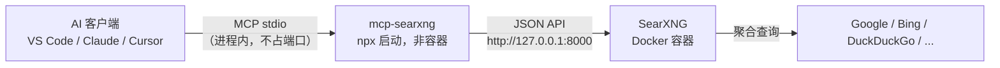

# SearXNG 部署 + MCP 接入

用 Docker Compose 部署 [SearXNG](https://docs.searxng.org)（元搜索引擎），再通过
[mcp-searxng](https://github.com/ihor-sokoliuk/mcp-searxng) 把它接入
Claude、VS Code Copilot、Cursor、Cline 等 AI 客户端，获得**隐私友好的联网搜索**能力。



> 设计取舍：**MCP 不跑在容器里** —— 由 AI 客户端用 `npx` 以 stdio 方式拉起，
> 随客户端生命周期启停、不占用端口；Docker 只负责 SearXNG 本体。
> 因此本目录只有一个容器，**不再需要 valkey 与 mcp 服务**。

## 目录结构

```
searxng-mcp/
├── docker-compose.yml   # 单服务：core（SearXNG）
├── .env                 # 端口、密钥（机密，已被本目录 .gitignore 忽略）
└── core-config/         # 挂载到容器的 /etc/searxng
    ├── settings.yml     # 已启用 JSON API（MCP 依赖）
    └── limiter.toml     # 限流配置（当前 limiter=false 未启用）
```

工作区根目录另有 `.vscode/mcp.json`，即 VS Code 的 MCP 客户端配置。

## 快速开始

```sh
cd searxng-mcp

# 1. 启动 SearXNG（-d 后台运行）
docker compose up -d

# 2. 查看状态 / 日志
docker compose ps
docker compose logs -f core

# 3. 验证 JSON API（应返回 JSON，若返回 403 说明未开启 json 格式）
curl -sS 'http://127.0.0.1:8000/search?q=searxng&format=json' | head -c 300

# 停止 / 删除
docker compose down        # 保留数据卷
docker compose down -v     # 连同 core-data 卷一并删除
```

SearXNG 网页界面：<http://127.0.0.1:8000> —— 同一端口同时提供网页 UI 与 JSON API
（MCP 后端即连此地址）。
> 端口在 `.env` 的 `SEARXNG_HOST` / `SEARXNG_PORT` 中配置，默认只绑定
> `127.0.0.1`（仅本机可用）。要允许局域网访问可把 `SEARXNG_HOST` 改为 `0.0.0.0`，
> 但请勿直接暴露到公网：SearXNG 本身无鉴权，公网开放容易被当作开源代理滥用
> （确需公网部署时，请自行加 HTTPS 反向代理并开启 `server.limiter` 与
> `server.public_instance`）。

## 接入 AI 客户端

所有客户端的链路都一样：**客户端 → `npx` 拉起 mcp-searxng（stdio）→ SearXNG 的 JSON API**。
前置条件：本机已装 Node.js（`npx` 随 Node 提供）、`docker compose up -d` 已启动 SearXNG。
唯一必需的配置项是 `SEARXNG_URL`。

### VS Code（本仓库已配好）

工作区根目录的 `.vscode/mcp.json`：

```json
{
  "servers": {
    "searxng-search": {
      "type": "stdio",
      "command": "npx",
      "args": ["-y", "mcp-searxng"],
      "env": { "SEARXNG_URL": "http://127.0.0.1:8000" }
    }
  }
}
```

打开 Copilot Chat → 智能体（Agent）模式 → 工具图标中即可看到 `searxng-search`
提供的工具；也可用命令面板的 `MCP: List Servers` 查看状态、重启服务、查看日志。

### Claude Desktop / Cursor / Cline 等

把同样的配置放进各客户端的 MCP 配置文件（键名通常是 `mcpServers`）：

```json
{
  "mcpServers": {
    "searxng": {
      "command": "npx",
      "args": ["-y", "mcp-searxng"],
      "env": { "SEARXNG_URL": "http://127.0.0.1:8000" }
    }
  }
}
```

### 可选环境变量

加在客户端配置的 `env` 里（**不是** `docker-compose.yml` —— MCP 已不在容器中运行）：

| 变量 | 作用 |
| --- | --- |
| `SEARXNG_URL` | **必填**，SearXNG 地址 |
| `SEARXNG_MAX_RESULTS` | 搜索返回条数上限，如 `10` |
| `SEARXNG_MAX_RESULT_CHARS` | 每条摘要字符数上限，如 `500`（省上下文） |
| `SEARXNG_DEFAULT_LANGUAGE` | 默认语言，如 `zh-Hans-CN` |
| `SEARXNG_DEFAULT_RESPONSE_FORMAT` | `text` 或 `json` |

### 只有 Docker、不想装 Node？

可以用容器跑 MCP，但需接入本项目的 Docker 网络
（网络名 = Compose 项目名 `searxng` + `_default`）：

```json
{
  "mcpServers": {
    "searxng": {
      "command": "docker",
      "args": [
        "run", "-i", "--rm",
        "--network", "searxng_default",
        "-e", "SEARXNG_URL=http://core:8000",
        "isokoliuk/mcp-searxng:latest"
      ]
    }
  }
}
```

> 这是备选路径而非默认方案，且需先执行过 `docker compose up -d` 让网络存在。

## 提供的 MCP 工具

| 工具 | 用途 |
| --- | --- |
| `searxng_web_search` | 联网搜索（支持分页、时间范围、语言、分类、引擎、结果条数） |
| `searxng_search_suggestions` | 搜索词自动补全，帮助细化查询 |
| `searxng_instance_info` | 查询实例支持的语言、分类、引擎等能力 |
| `web_url_read` | 抓取指定 URL 并转为 Markdown 正文（支持 PDF 文本抽取） |

### 检索技巧

- **`time_range` 必须搭配显式 `engines`**：SearXNG 要求**所有**被选中的引擎都支持
  时间过滤，否则直接返回 `400 Bad Request`。默认引擎集里含 `bing`（不支持），
  所以只传 `time_range` 必定失败。本实例共 261 个引擎，其中仅 15 个支持时间过滤，
  常用的如 `duckduckgo`、`brave`、`google cse`、`youtube`、`bing news`：

  ```
  searxng_web_search(query="...", engines="duckduckgo,brave", time_range="week")
  ```

- **不需要时间过滤时不要传 `engines`**，让全部引擎参与聚合，结果覆盖面更广。
- **单个引擎可能失效**：部分引擎会因反爬长期返回 0 结果（本实例的 `reuters`
  即是如此）。遇到 `No results found` 时换引擎或改用 `categories` 重试。
- 查询实例真实能力（含每个引擎的 `time_range_support`）：
  `curl -sS 'http://127.0.0.1:8000/config'`

## 验证部署

```sh
# 1. 网页界面 / 容器状态
curl -sS -o /dev/null -w '%{http_code}\n' 'http://127.0.0.1:8000/'
docker compose ps

# 2. JSON API（MCP 实际调用的接口）
curl -sS 'http://127.0.0.1:8000/search?q=searxng&format=json' | head -c 300

# 3. 可用引擎 / 分类 / 语言
curl -sS 'http://127.0.0.1:8000/config' | head -c 300

# 4. 端到端：在 AI 客户端里直接说「用 searxng 搜一下 xxx」
```

> 若 curl 返回 403 / 503 而容器日志正常：先检查本机是否设置了 `http_proxy` /
> `https_proxy` 环境变量（代理软件常会拦截 `127.0.0.1` 请求）。用
> `curl --noproxy '*' ...`，或在 `NO_PROXY` 中加入 `127.0.0.1` 即可绕过。

## 日常维护

```sh
# 更新到最新镜像
docker compose pull && docker compose up -d

# 固定 SearXNG 版本（推荐），编辑 .env：
# SEARXNG_VERSION=2026.9.25-12f8b6515
```

- **端口**：改 `.env` 的 `SEARXNG_PORT` 后，记得同步改客户端 `mcp.json` 里的 `SEARXNG_URL`。
- **密钥**：`SEARXNG_SECRET` 存在 `.env`（已被 `.gitignore` 忽略），会覆盖
  `settings.yml` 中的占位值 `ultrasecretkey`，请勿泄露或改回占位值。
- **数据卷**：`core-data` → `/var/cache/searxng`（favicon 缓存等）。
- **升级 mcp-searxng**：客户端用 `npx -y mcp-searxng`，默认每次拉最新版；
  需要固定版本可写成 `npx -y mcp-searxng@2.4.0`。
- **开启限流**：`.env` 中取消注释 `SEARXNG_LIMITER=true`，并按需调整
  `core-config/limiter.toml`。

## 常见问题

- **日志出现 `ahmia` / `torch`: can't register engine**：两者属于洋葱网络
  (`onions`) 类别，未配置 Tor 时被自动禁用，属**正常现象**。
- **日志出现 `X-Forwarded-For nor X-Real-IP header is set!`**：未接反向代理时的
  一次性提示，无影响。
- **搜索报 `Error (400): Bad Request`**：多半是 `time_range` 与所选引擎不兼容，
  见上文「检索技巧」。
- **`format=json` 返回 403**：JSON 未开启，检查 `core-config/settings.yml` 中
  `search.formats` 是否包含 `json`。
- **客户端看不到 MCP 工具**：确认 `node -v` 可用（`npx` 需要），再在 VS Code 中执行
  `MCP: List Servers` → 重启 `searxng-search` 并查看服务日志。
- **Docker Hub 拉取缓慢**：可在 Docker Desktop → Settings → Resources → Proxies
  配置 HTTP 代理（注意：浏览器里的 SOCKS5 代理不会自动作用于 Docker）；
  或改用镜像加速地址 / `ghcr.io/searxng/searxng` 镜像源。
- **想用本地源码构建镜像**：在 SearXNG 仓库根目录执行 `make container`，然后把
  `docker-compose.yml` 里 core 的 image 改为 `localhost/searxng/searxng:latest`。
- **公开部署**：本项目定位本机 / 内网使用。若需对公网提供服务，请自行增加
  HTTPS 反向代理，并在 `settings.yml` 中开启 `server.limiter` 与
  `server.public_instance`，参考
  [官方文档](https://docs.searxng.org/admin/installation-docker.html)。
