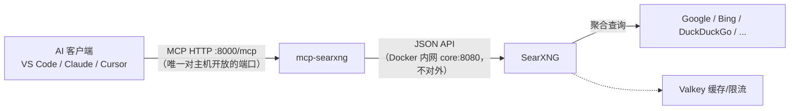

# SearXNG + MCP 一键部署

用 Docker Compose 部署 [SearXNG](https://docs.searxng.org)（元搜索引擎）和
[mcp-searxng](https://github.com/ihor-sokoliuk/mcp-searxng)（MCP 服务器），
让 Claude、VS Code Copilot、Cursor、Cline 等 AI 客户端获得**隐私友好的联网搜索**能力。



> SearXNG 的网页界面默认**不对外暴露**（`core` 服务没有主机端口映射），
> 只作为后端供 MCP 服务调用。

## 目录结构

```
searxng-mcp/
├── docker-compose.yml   # core(SearXNG) + valkey + mcp 三个服务
├── .env                 # 端口、密钥、Valkey 地址（机密，勿提交）
└── core-config/         # 挂载到容器的 /etc/searxng
    ├── settings.yml     # 已启用 JSON API（MCP 依赖）
    └── limiter.toml     # 限流默认配置（当前 limiter=false 未启用）
```

## 快速开始

```sh
cd searxng-mcp

# 启动（-d 后台运行）
docker compose up -d

# 查看状态 / 日志
docker compose ps
docker compose logs -f core mcp

# 停止 / 删除
docker compose down
```
**MCP 端点** | **http://127.0.0.1:8000/mcp** | 给 AI 客户端连接（HTTP 传输） |
| MCP 健康检查 | http://127.0.0.1:8000/health | 返回 `{"status":"healthy",...}` |
| ~~SearXNG 网页~~ | 仅在 Docker 内网 `core:8080` | 默认不对外开放；需要浏览器调试见下文 |

> MCP 端口只绑定 `127.0.0.1`（仅本机可用），且**不要暴露到公网**（无鉴权）。

需要临时用浏览器看 SearXNG 网页界面（调试用）时，打开 `docker-compose.yml` 中
`core` 服务被注释的 `ports:` 两行，然后 `docker compose up -d`，
访问 http://127.0.0.1:8080 ，用完再注释回去即可s":"healthy",...}` |

> 默认只绑定 `127.0.0.1`（仅本机可用）。要允许局域网访问，把 `.env` 中
> `SEARXNG_HOST` 改为 `0.0.0.0`，但**不要把 MCP 端口暴露到公网**（无鉴权）。

## 接入 AI 客户端

### VS Code（已为你配好）

工作区根目录已创建 `.vscode/mcp.json`，配置了 HTTP 型 MCP 服务器：

```json
{
  "servers": {
    "searxng": { "type": "http", "url": "http://127.0.0.1:8000/mcp" }
  }
}
```

在 VS Code 中打开 Copilot Chat → 智能体模式（Agent）→ 点击工具图标即可看到
`searxng` 提供的工具；也可以命令面板执行 `MCP: List Servers` 查看状态。

### Claude Desktop / Cursor / Cline（stdio 方式，无需本机 Node）

客户端自己拉起一个一次性容器作为 MCP 进程（适合不支持 HTTP 的客户端）。
它需要接入本项目的 Docker 网络才能访问 SearXNG（因为 8080 未对宿主机开放）：

```json
{
  "mcpServers": {
    "searxng": {
      "command": "docker",
      "args": [
        "run", "-i", "--rm",
        "--network", "searxng-mcp_default",
        "-e", "SEARXNG_URL=http://core:8080",
        "isokoliuk/mcp-searxng:latest"
      ]
    }
  }
}
```

> 网络名 = Compose 项目名（`searxng-mcp`）+ `_default`。
> 只有先执行过 `docker compose up -d`，该网络才存在。

### 任意支持 HTTP MCP 的客户端

直接填 URL：`http://127.0.0.1:8000/mcp`（VS Code / Claude Code / 新版 Cursor 等）。
若客户端只支持 stdio，又不想装 Docker 命令，可用 `mcp-remote` 桥接：

```json
{
  "mcpServers": {
    "searxng": {
      "command": "npx",
      "args": ["-y", "mcp-remote", "http://127.0.0.1:8000/mcp"]
    }
  }
}
```

## 提供的 MCP 工具

| 工具 | 用途 |
| --- | --- |
| `searxng_web_search` | 联网搜索（支持分页、时间范围、语言、分类、引擎、结果条数） |
| `searxng_search_suggestions` | 搜索词自动补全，帮助细化查询 |
| `searxng_instance_info` | 查询实例支持的语言、分类、引擎等能力 |
| `web_url_read` | 抓取指定 URL 并转为 Markdown 正文（支持 PDF 文本抽取） |

想让 AI 搜索更省上下文，可在 `docker-compose.yml` 的 `mcp` 服务中取消注释：

```yaml
      #SEARXNG_MAX_RESULTS: "10"        # 每次最多返回 10 条
      #SEARXNG_MAX_RESULT_CHARS: "500"  # 每条摘要截断到 500 字符
      #SEARXNG_DEFAULT_LANGUAGE: "zh-CN"
```

## 验证部署

```sh
# 1. MCP 健康检查
curl http://127.0.0.1:8000/health
# {"status":"healthy","server":"ihor-sokoliuk/mcp-searxng","version":"2.4.0","transport":"http"}

# 2. 列出 MCP 工具（旧版协议，curl 手测最方便）
curl -X POST http://127.0.0.1:8000/mcp \
  -H 'Content-Type: application/json' \
  -H 'Accept: application/json, text/event-stream' \
  -H 'MCP-Protocol-Version: 2025-06-18' \
  -d '{"jsonrpc":"2.0","id":1,"method":"tools/list","params":{}}'

# 3. 直接验证后端 SearXNG 的 JSON API（在 Docker 内网里执行）
docker compose exec core curl -sS 'http://127.0.0.1:8080/search?q=searxng&format=json'
```

## 日常维护

```sh
# 更新到最新镜像
docker compose pull && docker compose up -d

# 固定 SearXNG 版本（推荐生产环境），编辑 .env：
#SEARXNG_VERSION=2026.9.25-12f8b6515

# 修改端口：
#   MCP_PORT   —— MCP 在宿主机的端口（客户端连接地址）
#   SEARXNG_PORT —— SearXNG 的容器内部端口，一般无需改动

# 数据说明
#   core-data  卷：/var/cache/searxng（favicon 缓存等）
#   valkey-data 卷：限流计数等
#   配置：core-config/（settings.yml、limiter.toml）
```

## 常见问题

- **日志出现 `ahmia` / `torch`: can't register engine**：这两者属于洋葱网络
  (`onions`) 类别，未配置 Tor 时被自动禁用，属**正常现象**。
- **日志出现 `X-Forwarded-For nor X-Real-IP header is set!`**：未接反向代理时
  的一次性提示，无影响。
- **`format=json` 返回 403**：说明 JSON 未开启，检查 `core-config/settings.yml`
  中 `search.formats` 是否包含 `json`。
- **Docker Hub 拉取缓慢**：可在 Docker Desktop → Settings → Resources → Proxies
  配置 HTTP 代理（注意：浏览器里的 SOCKS5 代理不会自动作用于 Docker）；
  或改用镜像加速地址 / `ghcr.io/searxng/searxng` 镜像源。
- **想用本地源码构建镜像**：在仓库根目录执行 `make container`，然后把
  `docker-compose.yml` 里 core 的 image 改为 `localhost/searxng/searxng:latest`。
- **公开部署**：本项目定位本机/内网使用。若对公网提供服务，请自行增加
  HTTPS 反向代理，并在 `settings.yml` 中开启 `server.limiter` 与
  `server.public_instance`，参考
  [官方文档](https://docs.searxng.org/admin/installation-docker.html)。
